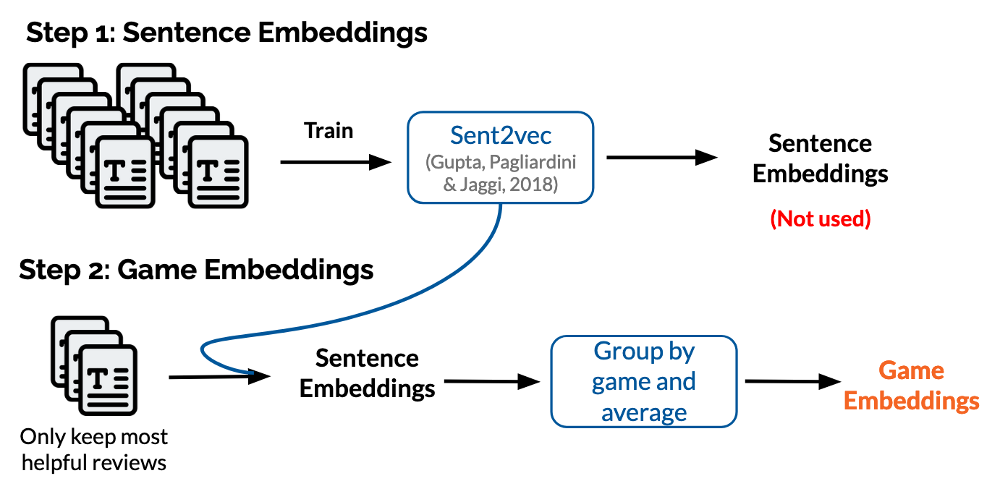



## Objectives
With this project we tried to answer the following questions:

- Are the game categories used usually relevant?
- Can we classify games by looking at the way players review them?
- Does this classification bare resemblance to the traditional categories?
- More specifically, can Machine Learning help define a new classification?

## Dataset presentation

For this project we used a huge dataset of steam reviews compiled in 2021 available on Kaggle[^1]. 

#### Contents
It contains 21 million user reviews, 10 million of which are in English, from around 300 different games.
For each review there is the text and the recommendation, but also additional metadata such as the number of games owned by the author,
the number of reviews they posted, if they received the game for free or if it was during early access. 

#### Source caveats
Because only a subset of all reviews from Steam were kept for this collection, potential biases were introduced.
We asked the author for more information on the selection of the games. They said: *"The games were picked by hand without stringent criteria. I did, however, pay attention to a few aspects and made an effort to include: both mainstream titles as well as indie titles, largely positively reviewed games as well as largely negatively reviewed games, and some older titles alongside newer titles, though you'll find most of the dataset is comprised of games released in 2017 and later."*.
They also added regarding the proportion of reviews collected for each selected game: *"I attempted to collect all the reviews at the time (Jan. 2021) for every title, and as such, no reviews were left out intentionally. I did observe there were some reviews missing but I do not have an exact number. If I remember correctly it was usually something like 1% of a game's reviews that was missing."*

#### Game tags
To complete our analysis, we gathered the official tags from steam (also called genres) and the most popular user-defined tags. This procedure was made manually and some tags were either broken down into subparts or ignored to avoid synonyms while staying general.
For example, FPS was broken down into 'First person' and 'Shooter', and 'Tactics' was ignored for the more frequent 'Strategy' was already taken. The decision to avoid/brake or not the different tags was highly subjective but mostly done by one person so whole distinction should at least be coherent.


## Game embeddings

To transform the huge quantity of reviews into a more usable material, we created game embeddings in a 100-dimensional space. This allowed us to later manipulate our 200 games with other machine learning techniques.
We hoped the results of those embeddings, carrying information from the way users talk about their games, would allow to reconstruct a classification similar to the way games are tagged.
<figure>
    
    <figcaption>First, reviews are treated as sentences and used to create sentence embeddings. Each game is then "embedded" as the mean vector formed by its most relevant reviews.</figcaption>
</figure>
The final game embeddings and similarly made tag embeddings can be visualized with tensorflow <a href="http://projector.tensorflow.org/?config=https://gist.githubusercontent.com/dmizr/6ed0d83d738a86a3d57e7a8455efe83f/raw/6b7aed45e8d7d5eec7d4f5fb0f71d9c74f0423e8/projector_config_all.json">here</a>.
With this visualization you can select a game on the point cloud or by typing its name and the program will return a list of the closest games. Keep in mind that the "proximity" is calculated on 100 dimensions, this is why although close in reality, games may not appear next to each other in the 3D projection. 
The closer games are to each other, the more similar are the ways their respective base of player talk about them. 
Although their is a loss of information when reducing a game to the average of its review vectors, we hope to still be able to classify the games by this kind of proximity.


## Classification with K-means clustering

We used K-means to make a simple classification from our game embeddings. After a bit of trial and error with different seeds and cluster number, we settled on a 20-cluster classification that produced fairly satisfying results. We used the silhouette score to determine the good number of clusters, but we also chose a high number for more variety.
<iframe frameborder="no" border="0" marginwidth="0" marginheight="0" width="100%" height="500" src="/html/clusters.html"></iframe>
If you know your games well, you see that the classification worked pretty well, but there are undoubtedly some oddities. 
Particularly satisfying are the clusters 3 and 19, which group grand strategy games such as the Civilization and Total War series, and Simulation games of all sorts respectively.
The cluster 5 is interesting because the games in it don't seem that similar, but still are linked by the fact that they are multiplayer games. 
Maybe their belonging to the same cluster is a sign that the multiplayer component is a truly important part of the game that supersedes the other aesthetic and gameplay components in most of the player's discussions. (Or maybe the model was just desperate to make a group, hard to say ;n;)

So, it appears we can effectively find a coherent classification using only the user reviews. 
Although this grouping is a bit uncertain and not without outliers, it seems that the model was able to capture enough information from the user's speech to form a coherent understanding of each game.


## How do the clusters compare to tags ?

The classical criteria to classify games is the use of tags to describe part of their aesthetic or some gameplay features. We would like to know if there are links between our clusters and the corresponding tags of each game. 
We isolated in each cluster the tags that were present in all its games to find out. One interesting thing to keep in mind is that the model for game embeddings had no information about the related tags during training outside the direct use of those words in the reviews. 

| Cluster | Length | Tags |
|-------|--------|---------|
| 1 | 11 | User Singleplayer |
| 2 | 8 | Steam Action, User Action, User Story Rich |
| 3 | 19 | User Multiplayer, User Singleplayer, User Strategy |
| 4 | 8 | User Adventure, User Great Soundtrack, User Singleplayer |
| 5 | 18 | Steam Action, User Action, User Multiplayer |
| 6 | 11 | - |
| 7 | 11 | User Co-op, User Multiplayer |
| 8 | 16 | - |
| 9 | 10 | Steam Action, User Action, User Co-op, User Shooter, User Singleplayer |
| 10 | 6 | Steam RPG, User Adventure, User Great Soundtrack, User RPG, User Singleplayer, User Story Rich |
| 11 | 11 | Steam Action, User Action, User Singleplayer |
| 12 | 10 | User Action |
| 13 | 11 | Steam RPG, User RPG |
| 14 | 7 | User Great Soundtrack, User Singleplayer |
| 15 | 5 | User Singleplayer |
| 16 | 6 | Steam Action, User Action, User Adventure, User Difficult, User Great Soundtrack |
| 17 | 8 | Steam Indie, User Indie, User Open World, User Sandbox, User Singleplayer |
| 18 | 9 | User Indie, User Singleplayer |
| 19 | 10 | Steam Simulation |
| 20 | 5 | User Puzzle |

The tags preceded by “Steam” are the official tags from steam and the “User” are the popularly defined ones. The length is the number of games in each cluster.

We see that most clusters effectively contain games with a couple of tags in common. 
It is interesting to see the contrast between the tags and the diversity of some clusters. Coming back to Group 5, we find the common idea of multiplayer action while the rest of the gameplay of these games is relatively varied.
We could interpret our clustering as the first sort, like selecting the defining feature of each game to place it in a cluster. 

Maybe this is an application that can be found to this study :
Ranking the tags by order of importance to the players. Finding the most defining feature of a game.
This could help the players orient themselves when looking for a specific type of experience as simply looking for a tag's presence does not carry information about its importance.



## A closer look at the reviews

#### Comparing four close games: _Night in the Woods_, _Undertale_, _OneShot_, and _To the Moon_
Four games appear close together in our embeddings: _Night in the Woods_, _Undertale_, _OneShot_, and _To the Moon_, with all of their [**values**] to one another contained between 0.161 and 0.230. [**Add comment about them being in same cluster or not depending on which clustering we use**]

Looking at the content of their reviews to try and find what patterns may have been found by the program, several elements are striking. The four games' reviews have frequent references to terms referring to:
- the story in a highly positive way, commenting on the quality of the writing
- emotions, with words such as 'feelings', 'cry', 'sad', 'happy'
- comments on the games not being focused on gameplay
- remarks on the high quality of the soundtrack
- the word 'experience'

The four of them have 'Story rich' and 'Great Soundtrack' in their top-3 user-defined tags. This is unsurprising: users reviewing the games and assigning them tags are most probably broadly the same people. Reading these four games' reviews, then, there seems to be lexical patterns justifying the measurements made by the program.

#### Anomaly? _Night in the Woods_ and _VA-11 Hall-A: Cyberpunk Bartender Action_
_Night in the Woods_ is the only game of this cluster having a closer neighbour than the three others in this group: _VA-11 Hall-A: Cyberpunk Bartender Action_. 
Supposedly, this game's reviews should have more in common with *Night in the Woods*'s than this latter would have with the three other games.
However, 'Story Rich' is the fourth user-defined tag, while 'Great Soundtrack' is absent of the list. Looking at the ten main tags for each game, nothing strikingly separates _Night in the Woods_ and _VA-11 Hall-A: Cyberpunk Bartender Action_ from _Undertale_, _To the Moon_ and _OneShot_.

_VA-11 Hall-A: Cyberpunk Bartender Action_'s reviews contains numerous mentions of sex, sexuality and alcohol, and terms such as 'waifu'/'weeb' are recurrent. Although the reviews frequently refer to the story's depth and how it affected the reviewer, terms such as 'feelings', 'sad' or 'happy' are mainly absent.

A possible link between this game and _Night in the Woods_ could be mental health issues, as terms directly related to these appear in the latter's review, and the former has mentions of alcoholism and personal or relational conflicts (in reference to the game's content). _VA-11 Hall-A: Cyberpunk Bartender Action_'s bring more information, as there are frequent mentions of the game's music as being great, as well as comments on beautiful visuals and a focus on storytelling. The writing is pointed at, though for being shallow and boring. These elements bring the game closer to the cluster previously observed but does not give any indication of a specific similarity with *Night in the Woods* (whose negative reviews mostly mention of the developer, Alec Holowka's suicide).

_VA-11 Hall-A: Cyberpunk Bartender Action_ can be understood as an anomaly when comparing these games' reviews. While it is crucial to keep in mind that this analysis is based on a non-exhaustive overview and that striking resemblances between both games may have been overlooked, this suggests that the game embeddings are built on elements that are not as obvious to the human eye as topics and words choice, at least not only. There are most probably strong elements behind the game embeddings that are inaccessible to us.

#### Opposites: _Undertale_ vs _Insurgency: Sandstorm_ and _Arma 3_
Finally, let us compare the 4-games cluster with opposite ones, focusing on _Insurgency: Sandstorm_ (1.541) and _Arma 3_ (1.526), the two most distant from Undertale. The first, classified as an Action game on Steam, has 'very positive' reviews, whose content bears these main topics:
- Comments on performance
- Mentions of sound but as in realistic rather than beautiful/enjoyable (sound design vs soundtrack)
- One comment with emotions: someone played with another one that was passionate, review says it was deeply appreciated

This game's reviews are, obviously strongly different from the games observed above. _Arma 3_, on the other hand, has mentioned of 'experience', 'depth' and intense feelings in its reviews that can be easily paralleled with the four-games cluster. The content of the reviews is far from identical, but contrary to _Insurgency: Sandstorm_, some elements share similarities. It is highly possible that terms such as 'experience' are too frequent to be used to distinguish games' reviews (such as 'game', for example), explaining these similarities between highly distanced games. In any case, this reinforces the possibility that games similarity based on the embeddings cannot be completely understood.

#### Concluding remarks?
[The program does not "understand English" so hard to visualise how the distances have been calculated, so these two games *may* be connected on elements that are unrelated to the meaning of the reviews; however lack of information as the analysis is made on an overview of only a part of the reviews, especially most helpful ones → not enough knowledge to have strong conclusions, only hypotheses]


## Recommendation Statistics

Number of reviews per category available you hover over them.

#### Average rating of the games in our dataset
<iframe frameborder="no" border="0" marginwidth="0" marginheight="0" width="100%" height="500" src="/html/average_all.html"></iframe>
discussions on this high number ?

#### Average rating of games received for free or not
<iframe frameborder="no" border="0" marginwidth="0" marginheight="0" width="100%" height="500" src="/html/recivedForFree.html"></iframe>
Surprisingly the same

#### Average rating of games played during early access or not
<iframe frameborder="no" border="0" marginwidth="0" marginheight="0" width="100%" height="500" src="/html/early.html"></iframe>
A bit more critical when game in early access

#### Average rating from users that posted a certain number of reviews
<iframe frameborder="no" border="0" marginwidth="0" marginheight="0" width="100%" height="500" src="/html/numReview.html"></iframe>
More critical when the user posts more reviews until a point

#### Average rating from users that own a certain number of games
<iframe frameborder="no" border="0" marginwidth="0" marginheight="0" width="100%" height="500" src="/html/owned.html"></iframe>
More critical when the user owns more games

#### Average rating from reviews with a certain number of words
<iframe frameborder="no" border="0" marginwidth="0" marginheight="0" width="100%" height="500" src="/html/words.html"></iframe>
The more there are words, the more critical the reviews become. We also found that positive reviews had an average of 35 words, with the median lenght being 10 words. For negative reviews we have an average of 76 words with a median length of 28 words.


#### Repartition of tags along each PCA axes
<iframe frameborder="no" border="0" marginwidth="0" marginheight="0" width="100%" height="500" src="/html/tag_repartition.html"></iframe>

<iframe frameborder="no" border="0" marginwidth="0" marginheight="0" width="100%" height="500" src="/html/dim_games.html"></iframe>

## References

[^1]: [Kaggle, *Steam Reviews Dataset 2021*, 2021](https://www.kaggle.com/najzeko/steam-reviews-2021)
