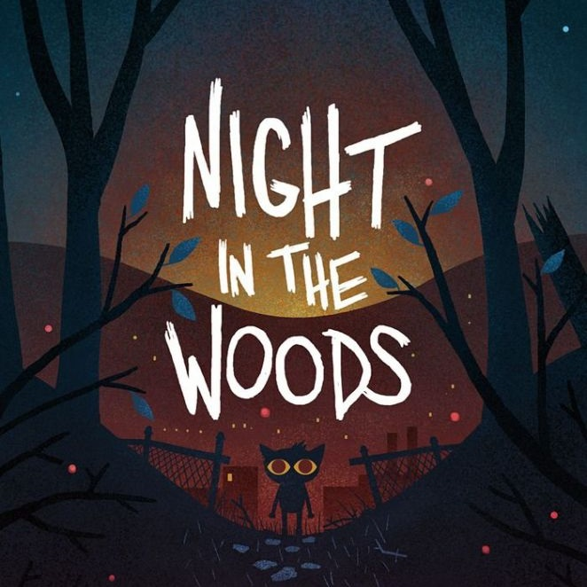



## Video Gamez r kool

The number and variety of video games is humongous. As a relatively new medium, video game’s impressive growth attracts numerous scholars from different fields, though in a sometimes frustrating way. Many studies are focused on small scales and lack representativity, while others stay on an abstract level with their data handling.

**So, what better way to make an interdisciplinary study of video games than to bring humanities, game studies and machine learning together?**

With an enormous dataset of Steam reviews, we question the relevance of game genres, explore the possibility of classifying games based on their reviews, and study the resemblance between this classification and genres as well as user-defined tags.
Continue reading for more details and other interesting numbers on Steam reviews!

## Table of Contents
   

- [Dataset](#dataset)
- [Game embeddings](#game-embeddings)
- [Classification with K-means clustering](#classification-with-k-means-clustering)
- [Clusters and tags comparison](#clusters-and-tags-comparison)
- [A closer look a the reviews](#a-closer-look-at-the-reviews)
- [PCA and classification](#pca-and-classification)
- [What about the users?](#what-about-the-users)
- [References](#references)

## Dataset

For this project, we used a large-scale dataset of Steam reviews compiled in 2021, which is openly available on Kaggle[^1]. 

#### Contents

This dataset consists of over 21 million Steam reviews, 10 million of which are in English, from over 300 different games. For each of these reviews, additional metadata is provided, such as the timestamp, the number of users who found that review helpful or funny, whether that game was received for free or during early-access, and other user-related information.
#### Source caveats

Because only a subset of all reviews from Steam were kept for this collection, potential biases were introduced.
We asked the author for more information on the selection of the games. They said: *"The games were picked by hand without stringent criteria. I did, however, pay attention to a few aspects and made an effort to include: both mainstream titles as well as indie titles, largely positively reviewed games as well as largely negatively reviewed games, and some older titles alongside newer titles, though you'll find most of the dataset is comprised of games released in 2017 and later."*.
They also added regarding the proportion of reviews collected for each selected game: *"I attempted to collect all the reviews at the time (Jan. 2021) for every title, and as such, no reviews were left out intentionally. I did observe there were some reviews missing but I do not have an exact number. If I remember correctly it was usually something like 1% of a game's reviews that was missing."*

#### Game tags

To complete our analysis, we gathered the official tags from Steam (also called genres) and the most popular user-defined tags. This procedure was made manually and some tags were either broken down into subparts or ignored to avoid synonyms while staying general.
For example, FPS was broken down into 'First person' and 'Shooter', and 'Tactics' was ignored for the more frequent 'Strategy' was already taken. The decision to avoid/break the different tags or not was highly subjective but mostly done by one person so whole distinction should at least be coherent. The games and their tags are publicly accessible [here](https://www.notion.so/ae461477418242858455d878c7647f5f?v=da64bc60b507481483510043f76169c3).

## Game embeddings

To transform the huge quantity of reviews into a more usable material, we created game embeddings in a 100-dimensional space. This allowed us to later manipulate our 200 games with other machine learning techniques.
We hoped the results of those embeddings, carrying information from the way users talk about their games, would allow to reconstruct a classification similar to the way games are tagged.
<figure>
    
    <figcaption>First, reviews are treated as sentences and used to create sentence embeddings. Each game is then "embedded" as the mean vector formed by its most relevant reviews.</figcaption>
</figure>
The final game embeddings and similarly made tag embeddings can be visualized with <a href="http://projector.tensorflow.org/?config=https://gist.githubusercontent.com/dmizr/6ed0d83d738a86a3d57e7a8455efe83f/raw/6b7aed45e8d7d5eec7d4f5fb0f71d9c74f0423e8/projector_config_all.json">Tensorflow</a>.
Here is a small page explaining how the [Embedding Projector]() works.
With this visualization you can select a game on the point cloud or by typing its name and the program will return a list of the closest games. Keep in mind that the "proximity" is calculated on 100 dimensions, this is why although close in reality, games may not appear next to each other in the 3D projection. 
The closer games are to each other, the more similar are the ways their respective base of player talk about them. 
Although there is a loss of information when reducing a game to the average of its review vectors, we hope to still be able to classify the games by this kind of proximity.

## Classification with K-means clustering

We used K-means to make a simple classification from our game embeddings. After a bit of trial and error with different seeds and cluster number, we settled on a 20-cluster classification that produced fairly satisfying results. We used the silhouette score to determine the good number of clusters, but we also chose a high number for more variety.
<iframe frameborder="no" border="0" marginwidth="0" marginheight="0" width="100%" height="500" src="/html/clusters.html"></iframe>
If you know your games well, you see that the classification worked pretty well, at the exception of some oddities. 
Particularly satisfying are the clusters 3 and 19, which group grand strategy games such as the _Civilization_ and _Total War_ series, and Simulation games of all sorts respectively.
The cluster 5 is interesting as it contains a lot of games, including several that don't seem that similar, apart from the fact that they are linked by being multiplayer games.
Maybe their belonging to the same cluster is a sign that the multiplayer component is the most salient part of the game, superseding the other aesthetic and gameplay features, in the players' reviews. (Or maybe the model was just desperate to make a group, hard to say ;n;)

So, hypotheses can be found to explain the regrouping of games when more obvious aspects are lacking. It appears that we can effectively find a coherent classification using only the users' reviews. To confidently verify the hypothesis that the fifth cluster gathers games because players pay more attention to the multiplayer feature of these games than the others, a thorough linguistic analysis of the reviews' content is necessary.
Although this grouping in 20 clusters is slightly uncertain and not without outliers, it seems that the model was overall able to capture enough information from the users' discourse to form a coherent understanding of each game.

## Clusters and tags comparison

The classical criteria to classify games is the use of genres that describe part of their aesthetic or some gameplay features. Steam also uses tags that users can assign to games, and the more popular ones are displayed on the games' pages on the platform. Do our clusters connect to the corresponding genres and tags of each game? 
To answer this question, we isolated for each cluster the genres and tags that were present in all of their games. One interesting thing to keep in mind is that the model for game embeddings had no information about the related tags during training outside the direct use of those words in the reviews, which is not highly significant [**Add the number of times "Indie" appears in the reviews ? Can't remember where's that info **]. 

| Cluster | Length | Steam Genres | User-defined Tags | Prototype |
|-------|--------|---------|---------|---------|
| 1 | 11 | - | User Singleplayer | _Oxygen Not Included_ |
| 2 | 8 | Action | Action, Story Rich | _Rise of the Tomb Raider_ |
| 3 | 19 | - | Multiplayer, Singleplayer, Strategy | _Total War Saga: Thrones of Britannia_ |
| 4 | 8 | - | Adventure, Great Soundtrack, Singleplayer | _GRIS_ |
| 5 | 18 | Action | Action, Multiplayer | _SCUM_ |
| 6 | 11 | - | - | _Slay the Spire_ |
| 7 | 11 | - | Co-op, Multiplayer | _BattleBlock Theater_ |
| 8 | 16 | - | - | _Danganronpa: Trigger Happy Havoc_ |
| 9 | 10 | Action | Action, Co-op, Shooter, Singleplayer | _Tom Clancy's Ghost Recon® Wildlands_ |
| 10 | 6 | RPG | Adventure, Great Soundtrack, RPG, Singleplayer, Story Rich | _Tales of Berseria_ |
| 11 | 11 | Action | Action, Singleplayer | _Resident Evil 2_ |
| 12 | 10 | - | Action | _Ravenfield_ |
| 13 | 11 | RPG | RPG | _Pillars of Eternity II: Deadfire_ |
| 14 | 7 | - | Great Soundtrack, Singleplayer | _PAYDAY 2_ |
| 15 | 5 | - | Singleplayer | _Euro Truck Simulator 2_ |
| 16 | 6 | Action | Action, Adventure, Difficult, Great Soundtrack | _Nioh: Complete Edition_ |
| 17 | 8 | Indie | Indie, Open World, Sandbox, Singleplayer | _Don't Starve_ |
| 18 | 9 | - | Indie, Singleplayer | _Super Meat Boy_ |
| 19 | 10 | Simulation | - | _Farming Simulator 19_ |
| 20 | 5 | - | Puzzle | _The Room_ |

The length indicates the number of games in each cluster, and the prototypes are the most central games in each cluster. Prototypes can be further analysed to try and create a classification system based on representative games, though this goes beyond the aim of our study.

We see that most clusters effectively contain games with a couple of tags or genres in common. 
It is interesting to see the contrast between the tags and the diversity of some clusters. Looking at cluster 5 again, we find the common idea of multiplayer action, while the rest of the gameplay of these games is relatively varied. This reinforces our earlier hypothesis but is insufficient to verify it. 
Following it, we could interpret our clustering as a model selecting the defining feature(s) of each game to then place them in corresponding clusters. Once again, this idea should be further explored by looking at the reviews and find whether the characteristics associated with the genres and tags standing out for each cluster do in fact appear significantly more than other patterns in the players' discourse.

Such results, with a more thorough analysis, could help us determine the most defining feature(s) of a game and classify genres and tags according to the value players assign to them in a game.
This could help players orient themselves more precisely when looking for a specific type of experience, contrary to simply search for a tag's or genre's presence in a game, which does not indicate how important this characteristic will be in said game.

In addition to this overall suggestion that some genres and tags are more salient than others depending on the games, this table offers an interesting perspective on genres and user-defined tags in themselves. Indeed, at the exception of cluster 19, all genres defined by Steam are appearing in the tags as well.

Supposedly, then, Steam users relate to the official genres. However, the games from clusters 2, 5, 9, 11, and 16 all share the same genre, Action. They distinguish by their tags, who are more precise. The same happens with the RPG genre in clusters 10 and 13. In cluster 13, the only tag shared by all games is RPG as well, while cluster 10 has several tags completing it. Possibly, the games from cluster 13 could be considered as the most representative of the RPG genre, while cluster 10 regroups RPG games with other salient features. 
Although the official genres are generally included in the user-defined tags, they appear to be insufficient by themselves, especially the Action genre.

If we were to create a new categorisation system, then, these genres would have their share of information to give, but what is most striking here is how important and useful players’ opinions and perspectives can bring to the discussion. 

## A closer look at the reviews
 
#### Comparing four close games: _Night in the Woods_, _Undertale_, _OneShot_, and _To the Moon_

Four games appear close together in our embeddings: _Night in the Woods_, _Undertale_, _OneShot_, and _To the Moon_, with all of their [**distance**] to one another contained between 0.161 and 0.230. [**Add comment about them being in same cluster or not depending on which clustering we use**]

    

        

            
        

        
        

            

                <h2> Night in the Woods </h2>  
                Night in the Woods is a single-player adventure game. It is a story-focused exploration game in which we play Mae, a character coming back to her hometown that she explores, meeting and interacting with non-playable characters.
            

        

    

 

    

        

            

                <h2> Undertale </h2>  
                In Undertale, we play a human who fell in a hole and ends up exploring an unknown world, encountering villagers and ‘enemies’ we can choose to fight or spare, with our main aim being to come back to the surface and in our own world.
            

        

        
        

            
        

    

 

    

        

            
        

        
        

            

                <h2> Oneshot </h2>  
                OneShot is a story in which we control a child from an outside perspective, acting as a sort of guardian for them. The game also has an interactive part with the operating system, which is praised in the reviews for its originality.
            

        

    

 

    

        

            

                <h2> To the Moon </h2>  
                To the Moon is a puzzle and adventure game. You play as two doctors exploring an old man’s memories to alter them, so that he can die with his dying wish completed in his memories.
            

        

        

            
        

    

Looking at the content of these games' reviews to try and find what patterns may have been found by the program, several elements are striking. The four games' reviews have frequent references to terms referring to:
- the story in a highly positive way, commenting on the quality of the writing
- emotions, with words such as 'feelings', 'cry', 'sad', 'happy'
- comments on the games not being focused on gameplay
- remarks on the high quality of the soundtrack
- the word 'experience'

The four of them have 'Story rich' and 'Great Soundtrack' in their top-3 user-defined tags. This is unsurprising: users reviewing the games and assigning them tags are most probably broadly the same people. Reading these four games' reviews, then, there seems to be lexical patterns justifying the measurements made by the program.

#### Anomaly? _Night in the Woods_ and _VA-11 Hall-A: Cyberpunk Bartender Action_

_Night in the Woods_ is the only game of this cluster having a closer neighbour than the three others in this group: _VA-11 Hall-A: Cyberpunk Bartender Action_. It is a game in which the player incarnates a bartender preparing and serving drinks to different customers while listening to them in a cyberpunk setting.

    

        

            
        

        
        

            

                <h2> VA-11 Hall-A: Cyberpunk Bartender Action </h2>  
                In this game you play a bartender at the eponymous VA-11 HALL-A, a small bar in a dystopian downtown which is said to attract the "most fascinating" of people. Gameplay consists of players making and serving drinks to bar attendees whilst listening to their stories and experiences.
            

        

    

Supposedly, this game's reviews should have more in common with _Night in the Woods_'s than this latter would have with the three other games. 
However, 'Story Rich' is the fourth user-defined tag, while 'Great Soundtrack' is absent of the list. Looking at the ten main tags for each game, nothing strikingly separates _Night in the Woods_ and _VA-11 Hall-A: Cyberpunk Bartender Action_ from _Undertale_, _To the Moon_ and _OneShot_.

_VA-11 Hall-A: Cyberpunk Bartender Action_'s reviews contains numerous mentions of sex, sexuality and alcohol, and terms such as 'waifu'/'weeb' are recurrent. Although the reviews frequently refer to the story's depth and how it affected the reviewer, terms such as 'feelings', 'sad' or 'happy' are mainly absent.

A possible link between this game and _Night in the Woods_ could be mental health issues, as terms directly related to these appear in the latter's review, and the former has mentions of alcoholism and personal or relational conflicts (in reference to the game's content). _VA-11 Hall-A: Cyberpunk Bartender Action_'s bring more information, as there are frequent mentions of the game's music as being great, as well as comments on beautiful visuals and a focus on storytelling. The writing is pointed at, though for being shallow and boring. These elements bring the game closer to the cluster previously observed but does not give any indication of a specific similarity with *Night in the Woods* (whose negative reviews mostly mention of the developer, Alec Holowka's suicide).

_VA-11 Hall-A: Cyberpunk Bartender Action_ can be understood as an anomaly when comparing these games' reviews. While it is crucial to keep in mind that this analysis is based on a non-exhaustive overview and that striking resemblances between both games may have been overlooked, this suggests that the game embeddings are built on elements that are not as obvious to the human eye as topics and words choice, at least not only. There are most probably strong elements behind the game embeddings that are inaccessible to us.

#### Opposites: _Undertale_ vs _Insurgency: Sandstorm_ and _Arma 3_

Finally, let us compare the 4-games cluster with opposite ones, focusing on the two most distant from Undertale: _Insurgency: Sandstorm_ (1.541), an action game according to Steam, and _Arma 3_ (1.526), classified as an action, simulation and strategy game. Both are online multiplayer games in which the players engage in shooting fights against other players.

    

        

            

                <h2> Insurgency: Sandstorm </h2>  
                Insurgency: Sandstorm is a multiplayer tactical first-person shooter. It is set in an unnamed fictional Middle Eastern region, the game depicts a conflict between two factions: "Security" and "Insurgents".
            

        

        

            
        

    

 

    

        

            
        

        
        

            

                <h2> Arma 3 </h2>  
                ARMA 3 is an open-world, realism-based, military tactical shooter video game. The single-player campaign has the player take control of U.S. Army soldier Corporal Ben Kerry. In the single player mode, the player is placed in a variety of situations, from lone wolf infiltration missions to the commanding of large-scale armored operations. This game has a very active modding community.
            

        

    

_Insurgency: Sandstorm_'s reviews contain recurrent comments on the game's performances, mentions of sound but as in realistic rather than beautiful/enjoyable (sound design vs soundtrack). A review stood out, describing how passionate another player was, and how this intense experience was deeply appreciated by the reviewer.
This game's reviews are obviously strikingly different from the games observed above. 
Similarly, _Arma 3_'s reviews contain mainly feedback on the game's content, which is similar to _Insurgency: Sandstorm_ and quite different from the four other games. However, the reviews contain mentions of 'experience', 'depth' and intense feelings - somewhat like the standing-out review from _Insurgency: Sandstorm_ - that can be paralleled with the four-games cluster. 

It is highly possible that terms such as 'experience' are way too frequent to be used as a way to distinguish games' reviews (like 'game', for example); this would explain the similarities between those highly distanced games. While some potential explanation can be found, slight similarities do exist between strongly opposed games in the embeddings.

#### Embeddings: a black box

As the program that created the embeddings does not understand English but measures the distances on grounds unknown to us, it is hard to understand _how_ the distances have been calculated and visualise _why_ two games will be close or distant. Consequently, _Night in the Woods_, _Undertale_, _OneShot_ and _To the Moon_ *may* be connected on elements that are unrelated to the meaning of their reviews. However, there is a crucial lack of information in this analysis, as it is based on an overview of only a part of the reviews, especially the ones voted the most helpful, so there is a huge lack of representativity here. No strong conclusions can be drawn here, only hypotheses pointing out the difficulty to pinpoint the elements determining the distance between games.

## PCA and classification

Sometimes, the PCA decomposition can lead to interesting projection vectors. 
Out of curiosity, we tried to see if the PCA dimensions had similarities with the tags repartition.
For each PCA dimension, we plotted the mean position of each tag 
(Once all games are projected, we calculate the mean position of all games possessing the tag).
On the second plot, you can visualize each dimension and the position of all tagged games to get a better idea.

#### Repartition of tags along each PCA axes 

<iframe frameborder="no" border="0" marginwidth="0" marginheight="0" width="100%" height="500" src="/html/tag_repartition.html"></iframe>
<iframe frameborder="no" border="0" marginwidth="0" marginheight="0" width="100%" height="500" src="/html/dim_games.html"></iframe>

It was expected, but individual axes do not correspond to individual tags and cannot be properly interpreted.
Still, we can use these graphics to find the most representative axes for a specific tag and better visualize groups of games on tensorflow.
(Try components 1,2 and 4, and select color by User Story Rich to see most of the Story Rich games clumped together in a corner of the space.)

Sadly that's all we can get out of the PCA analysis, no particular discoveries here...

## What about the users?

Let's deep-dive into some statistics analysis on the metadata from the database! The number of reviews per category available you hover over them.

#### Average rating of the games in our dataset 

<iframe frameborder="no" border="0" marginwidth="0" marginheight="0" width="100%" height="200" src="/html/average_all.html"></iframe>
We can see that the average score of the games in our database is quite high. This probably due to the selection of mostly popular games which tend to be well received.

#### Average rating of games received for free or not 

<iframe frameborder="no" border="0" marginwidth="0" marginheight="0" width="100%" height="300" src="/html/recivedForFree.html"></iframe>
This was one of the most surprising results we got. Apparently, on average (for the games in our database at least), receiving the game for free doesn't make you want to recommend a game more.

#### Average rating of games played during early access or not 
"Early access" is a term meaning that the game can be purchased when the game is still being developed, usually at a smaller price, so that the player can provide feedback on what should be fixed or improved.
<iframe frameborder="no" border="0" marginwidth="0" marginheight="0" width="100%" height="300" src="/html/early.html"></iframe>
From this result, we can see a small tendency to be more critical when a game is released in early access.
They usually have many bugs and sometimes a game change so much during development that early adopters of a game will not like how it is evolving and will then post "Not recommended" reviews in contest.
And this other funding model also have some issues, sometimes some game developers "take the money and go away", but those incidents are quite rare.

#### Average rating from users that posted a certain number of reviews 

<iframe frameborder="no" border="0" marginwidth="0" marginheight="0" width="100%" height="500" src="/html/numReview.html"></iframe>
Those results show that people will be more critical when posting more reviews until a certain point. This might be due to people noting their favourite games first and then the ones they dislike. And then you would have very active critics which might have a more nuanced view of games.

#### Average rating from users that own a certain number of games 

<iframe frameborder="no" border="0" marginwidth="0" marginheight="0" width="100%" height="500" src="/html/owned.html"></iframe>
We can see that the more someone owns games, the more likely they will be to rate a game down. This could be because when people play a lot of games, they will play a bigger proportion of indie game which tend to be less polished (gameplay- and graphically-wise) than game produced by big companies and will therefore rate them unfavourably.

#### Average rating from reviews with a certain number of words 

<iframe frameborder="no" border="0" marginwidth="0" marginheight="0" width="100%" height="500" src="/html/words.html"></iframe>
The more there are words, the more critical the reviews become.
We also found that positive reviews had an average of 35 words, with the median length being 10 words.
For negative reviews we have an average of 76 words with a median length of 28 words. It seems that when users do not recommend a game, they usually provide a detailed review on what they disliked about it; this is clearly visible in the results. 

## References 

[^1]: [Kaggle, *Steam Reviews Dataset 2021*, 2021](https://www.kaggle.com/najzeko/steam-reviews-2021)

### Images 
- 2017-11-11-170105.jpg (960×544). (2017, November 11). <https://pixeladventurers.com/wp-content/uploads/2017/11/2017-11-11-170105.jpg>
- 696436-arma-iii-windows-screenshot-moving-in-formation.jpg (1920×1080). (n.d.). Retrieved 8 June 2021, from <https://www.mobygames.com/images/shots/l/696436-arma-iii-windows-screenshot-moving-in-formation.jpg>
- 7551559D53AB49AE0A1D232EA6777497395A7F94 (640×480). (n.d.). Retrieved 8 June 2021, from <https://steamuserimages-a.akamaihd.net/ugc/103980755826651042/7551559D53AB49AE0A1D232EA6777497395A7F94/>
- 2953937288.jpg (500×710). (n.d.). Retrieved 8 June 2021, from <https://cdn.startselect.com/production/products/images/4d59f/58605/2953937288.jpg>
- Growing up is hard to do in Night in the Woods. (n.d.). VideoGamer.Com. Retrieved 8 June 2021, from <https://www.videogamer.com/features/growing-up-is-hard-to-do-in-night-in-the-woods>
- Isandstorm_09.jpg (1280×720). (n.d.). Retrieved 8 June 2021, from <https://www.newgamenetwork.com/images/uploads/gallery/InsurgencySandstorm/isandstorm_09.jpg>
- Latest (320×240). (n.d.). Retrieved 8 June 2021, from <https://static.wikia.nocookie.net/oneshot/images/d/da/OneShot_remake_title_card.png/revision/latest?cb=20170404075741>
- Media.jpg (1200×1090). (n.d.). Retrieved 8 June 2021, from <https://media.melty.fr/article-4334256-ajust_1200/media.jpg>
- Moon-Pic-3.png (500×375). (n.d.). Retrieved 8 June 2021, from <https://www.gbhbl.com/wp-content/uploads/2019/03/Moon-Pic-3.png>
- Oneshot_07.jpg (640×480). (n.d.). Retrieved 8 June 2021, from <https://www.newgamenetwork.com/images/uploads/gallery/Oneshot/oneshot_07.jpg>
- Sierra’s Adventures in YA Literature: Image. (n.d.). Retrieved 8 June 2021, from <https://sierraisalibrarian.files.wordpress.com/2020/10/nitw.jpg?w=662>
- To-the-moon-cover.cover_large.jpg (600×600). (n.d.). Retrieved 8 June 2021, from <https://images.nintendolife.com/77811ede754b2/to-the-moon-cover.cover_large.jpg>
- Valhalla.jpg (800×800). (n.d.). Retrieved 8 June 2021, from <https://thegamehoard.com/wp-content/uploads/2018/11/valhalla.jpg>
- Y9pNo0aCyzSO6yztekij-JH-wI1wev90a-bG_xm8RMuYEe32PI_sS5dA2sgpZKgJ-NE8QtUOzLwvmChd6UptmTswxI5FRK1Kz5HiQcc_QafkfG8 (362×512). (n.d.). Retrieved 8 June 2021, from <https://lh3.googleusercontent.com/proxy/Y9pNo0aCyzSO6yztekij-JH-wI1wev90a-bG_xm8RMuYEe32PI_sS5dA2sgpZKgJ-NE8QtUOzLwvmChd6UptmTswxI5FRK1Kz5HiQcc_QafkfG8>
